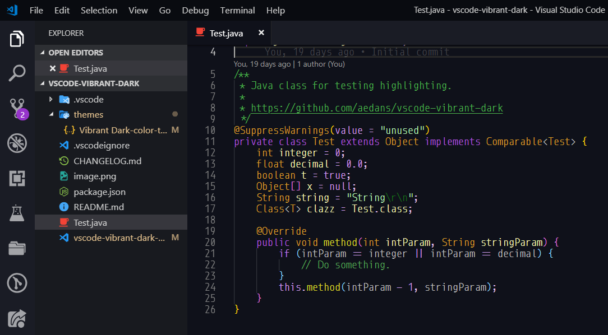

# VSCode Vibrant Dark



A vibrant VSCode dark theme.

## To Use

```bash
git clone https://github.com/aedans/vscode-vibrant-dark
cd vscode-vibrant-dark
vsce package
```

Then go to `Extensions -> ... -> Install From VSIX...` and select `vscode-vibrant-dark.vsix`.

Installing [Bracket Pair Colorizer 2](https://github.com/CoenraadS/Bracket-Pair-Colorizer-2) is also recommended.
